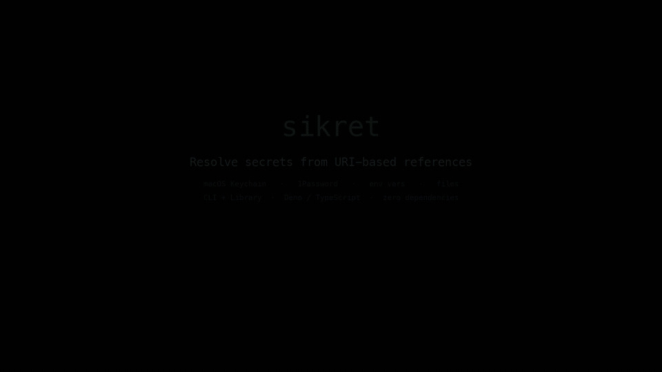

# sikret

Resolve secrets from URI-based references. Supports macOS Keychain, 1Password
CLI, environment variables, and files.



## Platform Support

`sikret` currently ships release archives for:

- macOS (Intel and Apple Silicon)
- Linux (x86_64)

FreeBSD users should build from source on the target machine for now. The
portable backends (`op`, `env`, and `file`) are the intended path there, but we
do not publish FreeBSD binaries because `deno compile` does not currently offer
a FreeBSD target.

Windows is not currently supported. It may be revisited in the future.

## Install

The CLI is intended to be consumed as a standalone `sikret` binary.

For normal use on macOS or Linux, download the archive for your platform from
the repo's Releases page, verify it against `SHA256SUMS.txt`, extract it, and
put `sikret` on your `PATH`.

If you maintain this repo or need a local build, build the binary locally with:

```sh
deno task compile
```

Deno is only needed to develop or package `sikret` from source. CLI consumers
should not need a Deno installation.

## CLI

```sh
# Resolve a single secret to stdout
sikret resolve keychain:openai-api-key

# Avoid putting the ref in argv/history
printf 'op://Private/openai/api-key' | sikret resolve --stdin

# Resolve as structured JSON
sikret resolve --json env:HOME

# Resolve a map file as JSON for automation
sikret export --json secrets.json

# Run a child process with resolved environment variables
sikret exec secrets.json -- ./my-app

# Keep the ref out of argv by loading it from an env var
OPENAI_API_KEY_REF='op://Private/openai/api-key' \
  sikret exec --ref-env OPENAI_API_KEY=OPENAI_API_KEY_REF -- ./my-app

# Inline a single secret ref without creating a JSON file
sikret exec --env OPENAI_API_KEY=op://Private/openai/api-key -- ./my-app
```

Prefer `sikret exec` or JSON output for automation. Use shell export output only
when you explicitly need shell syntax.

## Secrets File

A secrets file is a JSON object mapping environment variable names to secret
URIs:

```json
{
  "OPENAI_API_KEY": "keychain:openai-api-key",
  "ANTHROPIC_API_KEY": "op://Private/anthropic/api-key",
  "DEBUG": "env:DEBUG",
  "CERT": "file:/etc/ssl/private/cert.pem"
}
```

Keys used with `sikret export` or `sikret exec` must be valid environment
variable names.

## URI Schemes

| Scheme     | Format                        | Backend                                             |
| ---------- | ----------------------------- | --------------------------------------------------- |
| `keychain` | `keychain:<service-name>`     | macOS Keychain via `security`                       |
| `op`       | `op://<vault>/<item>/<field>` | 1Password CLI via `op read`                         |
| `env`      | `env:<VAR_NAME>`              | Environment variable                                |
| `file`     | `file:<path>`                 | File contents (single trailing line ending trimmed) |

## External Programs

### Shell Scripts and Other Processes

Use `sikret resolve` when you need a single value:

```sh
API_KEY="$(sikret resolve op://Private/openai/api-key)"
```

If you need to avoid putting the ref in argv or shell history, keep the ref in
an environment variable and let `sikret exec` resolve it:

```sh
OPENAI_API_KEY_REF='op://Private/openai/api-key' \
  sikret exec --ref-env OPENAI_API_KEY=OPENAI_API_KEY_REF -- ./my-app
```

`OPENAI_API_KEY_REF` is used only by `sikret` during resolution and is not
forwarded to the child process.

Use `sikret exec` when you want to inject multiple resolved values into a child
process without printing secrets to stdout:

```sh
sikret exec secrets.json -- ./my-app
```

For one-off script integrations, you can skip the JSON file and inject refs
inline:

```sh
sikret exec --env OPENAI_API_KEY=op://Private/openai/api-key -- ./my-app
```

Inline `--env` flags improve ergonomics, but the ref still appears in `sikret`'s
argv while the process runs. Use `--ref-env`, `secrets.json`, or
`resolve --stdin` when ref metadata exposure matters.

Use `sikret export --json` when another tool expects structured output:

```sh
sikret export --json secrets.json | jq -r '.OPENAI_API_KEY'
```

### `.env` Files

There is no built-in `.env` parser or background daemon. If another application
keeps secret refs in `.env`, use a wrapper convention such as `*_REF` and
resolve those refs before starting the target process:

```dotenv
OPENAI_API_KEY_REF=op://Private/openai/api-key
```

```sh
sikret exec --ref-env OPENAI_API_KEY=OPENAI_API_KEY_REF -- ./my-app
```

For batch workflows, a JSON secrets file is the native format today.

## Library

The library API is Deno-first. Import from JSR and pass an explicit backend
registry so your application only enables the backends it actually needs:

```typescript
import { createOpBackend, createRegistry, resolve } from "jsr:@srdjan/sikret";

const registry = createRegistry([createOpBackend()]);
const result = await resolve("op://Private/openai/api-key", registry);

if (!result.ok) {
  throw new Error(result.error.tag);
}

console.log(result.value);
```

## Development

```sh
deno task test
deno task check
deno task compile
```
